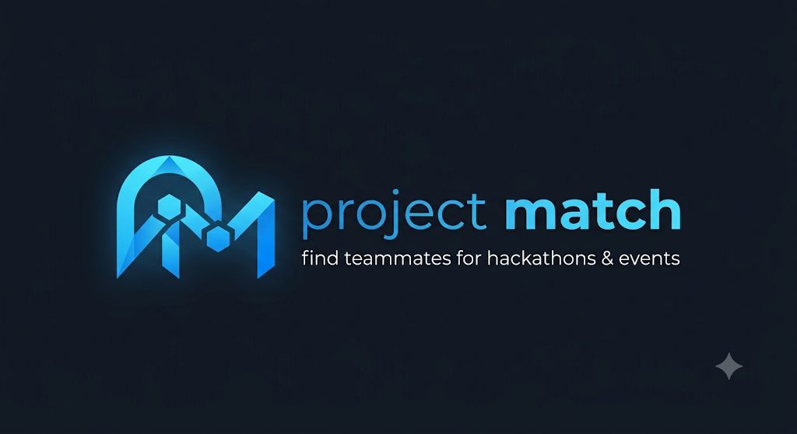

# ProjectMatch: AI-Powered Team Formation Platform

 <!-- Update with an actual screenshot path later if desired -->

**ProjectMatch** is a next-generation platform designed to solve the friction of team formation for hackathons, research projects, startups, and university groups. By moving beyond existing social circles, ProjectMatch leverages autonomous AI analysis and mathematical matching algorithms to seamlessly pair creators with the exact complementary skills they need.

## 🌟 The Problem
When people need to form teams for projects or hackathons, they rely heavily on existing social connections. A backend developer might desperately need a UI/UX designer, but if they don't know one, their project suffers. ProjectMatch shatters this barrier by making team discovery skill-based, intent-driven, and highly accessible.

## ✨ Core Features

### 🧠 AI Teammate Generator
Stop guessing what roles you need to hire.
- **Project Parsing**: Describe your project idea in plain English. The AI breaks it down, extrapolates the required tech stack, and estimates a timeline.
- **Complementary Matching**: Input your *Available Skills*, and the algorithm instantly calculates your *Missing Skills*. It then runs a Jaccard Similarity match against the entire user database to surface the top 3 candidates who perfectly complement your stack.

### 🔍 Discovery & Hackathon Routing
- **Half-Filled Teams Feed**: Browse the `/discover` route to find teams that are actively recruiting. See exactly what roles they are missing and send a "Request to Join" with one click.
- **Event-Driven Filtering**: Competing in a hackathon? Click "Find a Team" on the Events page to automatically filter the Discovery feed for teams participating in your specific event.

### 💬 WhatsApp-Style Messaging
- Real-time, dual-pane messaging interface designed for rapid collaboration.
- Discuss hardware integrations, share code snippets, and review PRs natively without leaving the platform.

### 👤 Robust Developer Profiles
- Display your Academic Year, Degree, Experience level, and Availability (e.g., Weekends, Evenings).
- Toggle 35+ specialized skill chips covering Hardware (ROS, IoT, C++), AI (PyTorch, TensorFlow), Software (Next.js, AWS), and Web3.
- **GitHub Integration**: Link your GitHub account to dynamically display your latest repositories and commits directly on your profile.

## 🛠 Tech Stack

- **Framework**: [Next.js 16](https://nextjs.org/) (App Router, Turbopack)
- **Styling**: [Tailwind CSS](https://tailwindcss.com/)
- **UI Components**: [Radix UI](https://www.radix-ui.com/) + Custom Motion Primitives
- **Animations**: [Framer Motion](https://www.framer.com/motion/)
- **Icons**: [Lucide React](https://lucide.dev/)
- **Database / Auth**: Mocked Firebase Integration (Ready for scalable production)

## 🚀 Getting Started

1. **Clone the repository:**
   ```bash
   git clone https://github.com/yourusername/projectmatch.git
   cd projectmatch
   ```

2. **Install dependencies:**
   ```bash
   npm install
   ```

3. **Run the development server:**
   ```bash
   npm run dev
   ```

4. Open [http://localhost:3000](http://localhost:3000) in your browser.

## 🤝 Contributing
Contributions, issues, and feature requests are welcome! Feel free to check the [issues page](https://github.com/yourusername/projectmatch/issues).

---
*Built with ❤️ for hackers, builders, and dreamers.*
